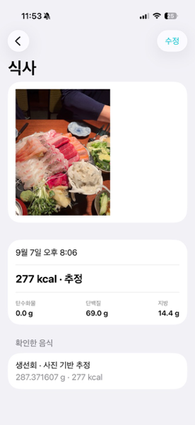
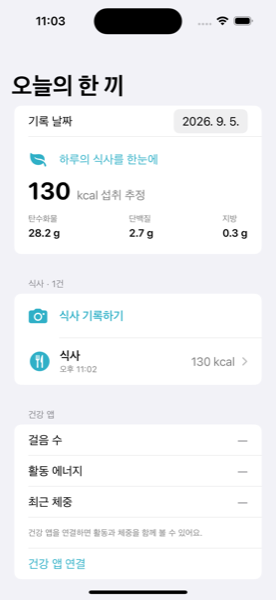

# 한 끼 · MealLens

사진을 찍으면 기기 안에서 음식 종류와 먹은 양을 추정하고, 예상 칼로리와 영양소를 계산하는 iOS 앱입니다. SwiftUI, Vision, Core ML, HealthKit, Photos, SwiftData만 사용하며 외부 AI API로 사진을 보내지 않습니다.

## 화면 미리보기






## 사용 방법

1. 대시보드에서 **식사 기록하기**를 누릅니다.
2. 사진을 찍거나 사진 보관함에서 음식 사진을 고릅니다.
3. Core ML 모델이 음식 종류를 찾고, 앱이 사진과 음식 종류를 바탕으로 먹은 양을 추정합니다.
4. 추정 중량과 칼로리가 자동으로 입력됩니다. 필요할 때만 숫자를 수정합니다.
5. 저장하면 오늘의 칼로리와 탄수화물·단백질·지방 합계에 반영됩니다.

국·찌개는 약 300g, 피자는 약 180g, 고기류는 약 180g처럼 음식별 대표량을 사용합니다. 사진 한 장으로 실제 그램을 측정하는 기능이 아니라, 사진 기반의 실용적인 추정값입니다.

## 주요 기능

- Food-101 기반 101개 음식 Core ML 분류 모델
- 사진 선택·카메라 촬영·사진 다시 분석
- 사진 기반 음식명·중량·칼로리 자동 추정
- 음식과 중량을 직접 수정할 수 있는 편집 화면
- 하루별 식사 합계와 식사 상세·수정·삭제
- HealthKit 걸음 수·활동 에너지·최근 체중 읽기
- SwiftData 로컬 저장
- 한국어 네이티브 UI와 앱 아이콘

## 프로젝트 구조

| 파일 | 역할 |
| --- | --- |
| `MealLens/MealLensApp.swift` | 앱 시작과 SwiftData 컨테이너 |
| `MealLens/DashboardView.swift` | 오늘의 합계와 건강 데이터 |
| `MealLens/MealEditorView.swift` | 사진 분석, 자동 추정, 식사 저장 |
| `MealLens/FoodClassifier.swift` | Vision/Core ML 온디바이스 추론 |
| `MealLens/Nutrition.swift` | 음식 카탈로그와 사진 기반 양·영양 추정 |
| `MealLens/FoodClassifier.mlmodel` | 실험용 Food-101 분류 모델 |
| `ModelTraining/` | 데이터 병합·검증·Create ML 학습 도구 |

## 학습 데이터와 모델

Food-101 글로벌 음식 이미지와 AI Hub 한국 음식 이미지 150종을 로컬에서 확보했습니다. 현재 앱에 포함한 모델은 Food-101 101개 클래스의 경량 학습 모델입니다. AI Hub 한식 데이터는 150개 음식·150,507장을 색인했으며, 전체 통합 학습은 Create ML 메모리 오류로 별도 보관 중입니다.

학습 모델은 음식 종류를 추정합니다. 중량·숨은 재료·조리법을 직접 측정하지 않으므로 칼로리는 개인 기록용 추정값으로 표시합니다. 데이터셋별 이용 조건과 파생 모델 재배포 조건을 확인한 뒤 상용 배포해야 합니다. 자세한 내용은 `ModelTraining/MODEL_CARD.md`와 `VALIDATION.md`를 참고하세요.

## 빌드

Xcode에서 `MealLens.xcodeproj`를 열고 `MealLens` 스킴을 선택한 뒤 실행합니다. 실제 iPhone에서는 개발 팀과 고유 번들 식별자를 설정하고 카메라·HealthKit 권한을 허용해야 합니다.

```sh
xcodebuild -project MealLens.xcodeproj -scheme MealLens \
  -sdk iphonesimulator -configuration Debug CODE_SIGNING_ALLOWED=NO build

xcodebuild test -project MealLens.xcodeproj -scheme MealLens \
  -destination 'platform=iOS Simulator,name=iPhone 15 Pro,OS=17.5'
```

검증 결과는 `VALIDATION.md`에 기록되어 있습니다.
